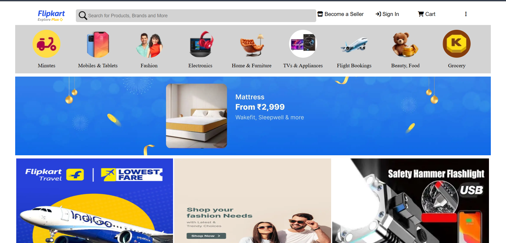

# 🛒 Flipkart Clone (HTML + CSS)

A static clone of the Flipkart homepage built using **pure HTML and CSS**. This project recreates the visual layout and design of the Flipkart shopping platform, ideal for practicing front-end development and responsive web design.

---

## 🔍 Project Preview

> Screenshot of the homepage UI.

---

## 🧑‍💻 Tech Stack

- **HTML5** – Structure and layout
- **CSS3** – Styling and responsiveness

> ⚠️ This project is a **UI-only static clone**, with no backend or interactivity.

---

## 💡 Features

- Flipkart-style top navbar with logo, search bar, login, and cart icons
- Clean product sections and categories
- Deal banners, offers, and cards styled using Flexbox/Grid
- Responsive design layout for desktop and mobile

---

## 📂 Folder Structure

